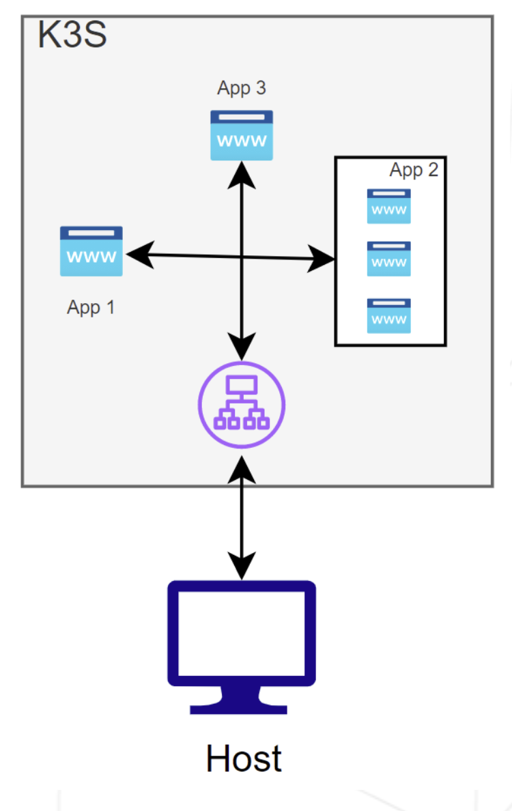
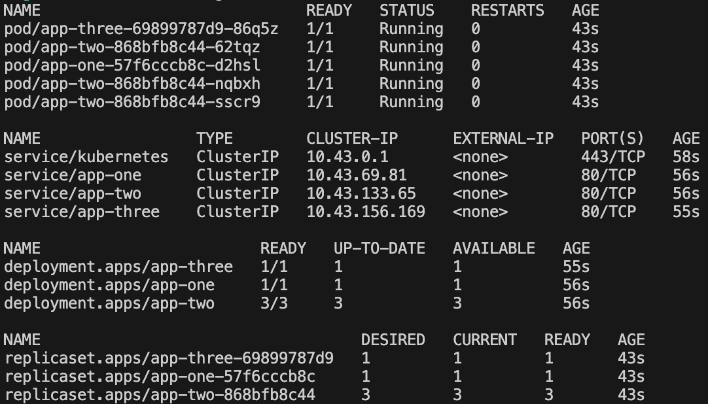

# Inception-of-Things
K3d and K3s with Vagrant

## p1 - K3s and Vagrant


## p2 - K3s and three simple applications

This README guides you through setting up a Kubernetes (K3s) deployment that hosts three different web applications. Access to these applications is controlled by the `HOST` header in HTTP requests, allowing you to access each app by visiting a specific domain name pointed at the IP `192.168.56.110`.

This command should displays you the info from `app-one`.
```bash
curl -H "Host:app1.com" 192.168.56.110
```

### Overview

We will set up three web applications, referred to as `app1`, `app2`, and `app3`. The access to these applications will be managed by an Ingress controller, which routes traffic to the appropriate application based on the `HOST` header:

- **app1.com:** Routes to `app1`
- **app2.com:** Routes to `app2`
- **Default:** Any other `HOST` value will route to `app3`



### Prerequisites

- VirtualBox, used to create the VM and the deployment over it.
- The Kubernetes cluster is hosted over a VM, specified in this [Vagrantfile](Vagrantfile).
- A Kubernetes cluster (K3s) set up and accessible.

### 1: Deployments

We'll create three [deployments](https://kubernetes.io/docs/concepts/workloads/controllers/deployment/), one for each web application.

### 2: Services

For each deployment, create a corresponding [service](https://kubernetes.io/docs/concepts/services-networking/service/). This will allow the Ingress controller to route traffic to the correct pods.

### 3: Ingress

Finally, configure an [Ingress](https://kubernetes.io/docs/concepts/services-networking/ingress/#hostname-wildcards) to route traffic based on the HOST header.

### Usage

Deploy:

```bash
vagrant up
```

If case you want to access the VM:

```bash
vagrant ssh rcabezas
```

Inside the VM this will be the result:

```bash
k get all
```



### Resources

- [Ingressing with k3s](https://carpie.net/articles/ingressing-with-k3s)
- [Ingress Controller on k3s](https://www.suse.com/c/rancher_blog/deploy-an-ingress-controller-on-k3s/)

### p3 - K3d and Argo CD
